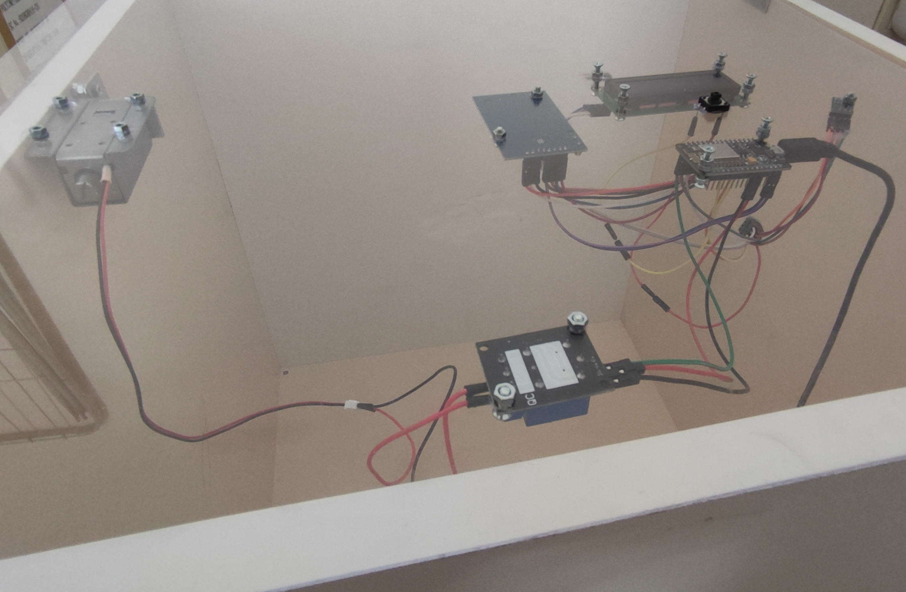
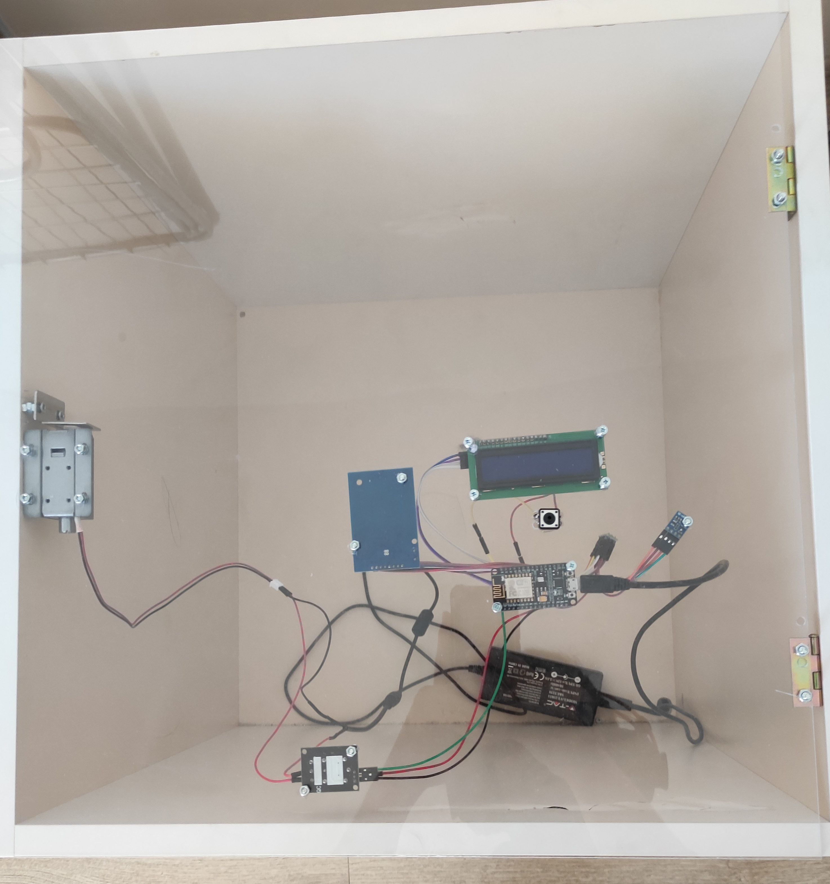

<!-- PROJECT LOGO -->
<br />
<p align="center">
  <a href="https://github.com/github_username/repo_name">
    
  </a>

  <h3 align="center">smart-locc</h3>
  <p align="center">
    Smart lock project implementation as part of the IoT course at FMI.
    <br />
    <a href="https://github.com/allexks/smart-locc/issues">Report Bug</a>
    ·
    <a href="https://github.com/allexks/smart-locc/issues">Request Feature</a>
  </p>
</p>
<!-- BADGES -->

<p align="center">
    <a href="https://github.com/allexks/smart-locc/actions">
        
    </a>
    <a href="https://github.com/allexks/smart-locc/issues">
        
    </a>
    <a href="https://github.com/allexks/smart-locc/pulls">
        
    </a>
</p>

<!-- TABLE OF CONTENTS -->
## Table of Contents
<ol>
    <li>
        <a href="#about-the-project">About The Project</a>
    </li>
    <li>
        <a href="#getting-started">Getting Started</a>
        <ul>
            <li><a href="#prerequisites">Prerequisites</a></li>
            <li><a href="#installation">Installation</a></li>
        </ul>
    </li>
    <li><a href="#usage">Usage</a></li>
    <li><a href="#roadmap">Roadmap</a></li>
    <li><a href="#contributing">Contributing</a></li>
    <ul>
        <li><a href="#contribors">Contributors</a></li>
    </ul>
    <li><a href="#license">License</a></li>
</ol>

<!-- ABOUT THE PROJECT -->

## About The Project

This project is an implementation of a power-off lock/unlock with RFID chips.
There are two admin keys/chips which are used for adding new user chips.
To register a new chip you need to press a button and authorize as an administrator with one of the two admin chips.

There is also a display showing messages and the room temperature to the user.
The scheme is connected to WiFi using WiFiManager.
All of the information for the events is sent to Ubidots dashboard which tracks the successful/unsuccessful unlock attempts.

<!-- GETTING STARTED -->

## Getting Started

To get it up and running follow these simple steps.

### Prerequisites

- Arduino IDE
- ESP8266/ESP32
- Bounce2
- LiquidCrystal I2C
- MFRC522
- WiFiManager
- PubSubClient
- Sodaq_SHT2x

### Installation

1. Clone the repo
   ```sh
   git clone https://github.com/allexks/smart-locc.git
   ```
2. Connect the sensors as shown below and upload it to the ESP8266/ESP32

<!-- USAGE -->

## Usage




<!-- ROADMAP -->

## Roadmap

See the [open issues](https://github.com/github_username/repo_name/issues) for a list of proposed features (and known issues).

## Contributing

Feel free to dive in! [Open an issue](https://github.com/allexks/smart-locc/issues/new) or submit PRs.

The project follows the [Contributor Covenant](http://contributor-covenant.org/version/1/3/0/) Code of Conduct.

### Contributors

<a href="https://github.com/allexks">
  
</a>
<a href="https://github.com/ihristova11">
  
</a>
<a href="https://github.com/zotakk4o">
  
</a>

## License
